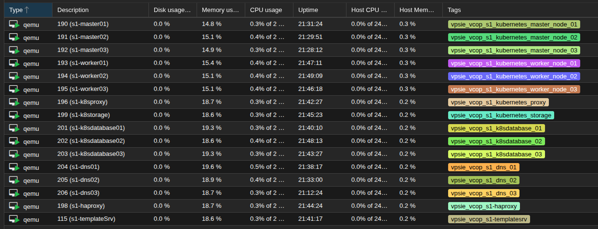

# vcop-tf

This project provisions all the virtual machines (VMs) required for the VPSie VCOP platform using Terraform. It automates the deployment of Kubernetes clusters, databases, DNS servers, and haproxy on a Proxmox environment, ensuring a consistent and repeatable infrastructure setup for the VCOP.

## Prerequisites

- [Terraform](https://www.terraform.io/downloads.html) >= 1.0
- Access to a Proxmox server
- API credentials for Proxmox
- SSH key for VM access
- Preconfigured Cloudinit template - [How to create cloudinit template](./docs/citemplate.md)

## How to use

1. **Clone the repository:**

   ```bash
   git clone <your-repo-url>
   cd vcop-tf
   ```

2. **Configure variables:**
   - Create/Edit `terraform.tfvars` with your environment details (Proxmox endpoint, credentials, network, resources, etc.).

3. **Initialize Terraform:**

   ```bash
   terraform init
   ```

4. **Review the execution plan:**

   ```bash
   terraform plan
   ```

5. **Apply the configuration:**

   ```bash
   terraform apply
   ```

6. **Check outputs:**
   - After apply, Terraform will print IPs and other details for your deployed resources.

## What it Creates

- Kubernetes Cluster
- Database Cluster
- DNS Cluster
- HAProxy
- TemplateSrv


## Project Structure

- `main.tf` - Main infrastructure definition and module usage.
- `variables.tf` - Input variables for configuration.
- `terraform.tfvars` - Your environment-specific variable values.
- `outputs.tf` - Outputs for deployed resources.
- `modules/` - Custom modules for Kubernetes, database, DNS, and other servers.

## Clean Up

To destroy all resources:

```bash
terraform destroy
```
